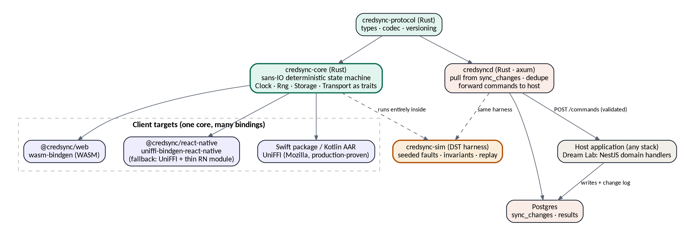

<!--
  credSync Design Document v2.1
  Converted from credSync_Design_v2.1.docx - do not edit by hand.
  Source of truth: credSync_Design_v2.1.docx
  Regenerate: scripts/convert-docs.sh
-->

**credSync**

Design Document v2.1 — Rust Core Edition

_An open-source, offline-first sync engine for apps on unreliable networks_

Version 2.1 · 24 August 2026 · Apache-2.0

Supersedes §7 of the Dream Lab OS Platform Plan v1.1 · Build brief for the credsync repository (Claude Code)

## Contents
1\. Purpose & positioning 3

2\. Prior art — what the field taught us 4

3\. Language decision — Rust vs Go 5

4\. Architecture — a sans-IO deterministic core 6

5\. Protocol v1 (hardened) 7

6\. Conflict policy 8

7\. Robustness engineering — how credSync earns trust 9

8\. Security model 10

9\. Repository & crate layout 11

10\. Build plan for Claude Code (M0–M7) 12

11\. Risks specific to the Rust path 13

12\. Open questions 14

## 1. Purpose & positioning
credSync is an open-source, offline-first data synchronization engine for client applications on unreliable networks — designed for the 2G-worst, 3G-typical, intermittent-always reality of its first users. It is server-authoritative and command-based: state flows down as ordered snapshots from an append-only change log; writes flow up as domain commands that the host application validates. It never merges business data by guesswork, and it never loses an acknowledged write.

What changed from v1 of this design: the core is written in Rust as a sans-IO deterministic state machine, verified by a deterministic simulation testing (DST) harness in the tradition of FoundationDB and TigerBeetle, and bound from one codebase to React Native, native iOS/Android, and the web. The protocol gains integrity hardening: batch checksums, per-scope state digests for silent-divergence detection, and a self-heal path. The v1 principles all survive: four-page protocol ceiling, snapshots not diffs, commands not row writes, scopes as the isolation unit.

-   **Reference consumer:** Dream Lab OS student app (entities: lessons, submissions, reflections; the platform adds residency\_stages and action\_plans as owner-draft LWW classes and graduation\_checks as pull-only). Planned second consumer: MySaurify rider app.
-   **Name status (verified 24 Aug 2026):** npm 'credsync'/'cred-sync' and crates.io 'credsync'/'cred-sync' all unregistered. GitHub org to be confirmed manually. README leads with 'offline-first sync engine' to pre-empt the credentials-tool misreading.
-   **License:** Apache-2.0 across every crate and package — the platform plan's IP answer: Ukeme owns the project; Dream Lab OS and MySaurify consume it as ordinary dependencies.

## 2. Prior art — what the field taught us
Before writing an engine, we studied the ones that exist, the ones that died, and the techniques that made the reliable ones reliable. Each lesson below is adopted as a design commitment, not a footnote.

| **Source** | **What it does / what happened** | **Lesson adopted in credSync** |
| --- | --- | --- |
| PowerSync | Bidirectional Postgres↔SQLite sync; Rust SQLite-extension client core; writes go through a developer-defined upload endpoint; service layer is source-available (FSL), not fully OSS | Validates our shape: local SQLite + upload queue + host-validated writes. The Rust client core is industry precedent. The licensing gap is credSync's opening |
| ElectricSQL | Pivoted from CRDT active-active to a read-path sync engine; writes go through your own API — an explicit retreat from bidirectional merge complexity | The strongest teams walked back automatic merge. credSync never attempts it: commands up, snapshots down |
| Replicache → Zero | Pioneered git-like client rebase with server-authoritative mutators; Replicache was sunset in favor of Zero | Server-authoritative mutations are the durable idea. Vendor churn is real: own the engine, license it openly |
| Triplit, Atlas Device Sync | Company folded to OSS initiative; vendor sync products get deprecated | Never build a product's offline story on a vendor's continued existence |
| Firefox Sync (Mozilla) | Sync core written once in Rust, deployed to Kotlin and Swift apps via UniFFI at hundreds-of-millions scale | The exact architecture credSync adopts: one Rust core, generated bindings per platform |
| FoundationDB / TigerBeetle | Deterministic simulation testing: hundreds of millions of seeded simulations equivalent to millennia of operation; any failure replays exactly from a seed | The core is designed sans-IO from day one so the whole engine runs inside a seeded simulator (§7) |
| S2 / RisingWave (madsim, turmoil) | Practical Rust DST: runtime-level simulation is not enough — wall-clock time and entropy leak through dependencies unless injected explicitly | Clock, Rng, storage, and transport are trait parameters of the core. Nothing inside the state machine touches the real world |
| CouchDB/PouchDB lineage | Decades of revision-tree sync; taught the field about tombstones, resumable replication via sequence numbers | Cursor-on-append-only-log and tombstone deletes are the boring, proven mechanics we keep |

**The composite lesson:** the industry converged on exactly the shape credSync v1 sketched — local SQLite, ordered log pull, host-validated command push — and the engines that earned production trust did it with a Rust core and, in the most reliable systems, deterministic simulation. credSync's contribution is packaging that consensus as a genuinely open, backend-agnostic engine sized for solo-maintainable scope.

## 3. Language decision — Rust vs Go
Both languages can build a fine sync server. The decision is forced by the client core: credSync's hardest code must run inside React Native (Hermes), native iOS and Android, and eventually the browser — embedded, cross-compiled, with no runtime of its own.

| **Criterion** | **Rust** | **Go** |
| --- | --- | --- |
| Embedding in mobile apps | First-class: UniFFI generates Kotlin/Swift bindings; production-proven at Mozilla scale for a sync core specifically | gomobile exists but is awkward; large binaries; GC runtime rides along inside the host app |
| React Native | uniffi-bindgen-react-native generates TypeScript Turbo Modules (early-stage; fallback: UniFFI bindings + thin hand-written RN module) | No maintained first-class path |
| Web (WASM) | wasm-bindgen; small modules; same core compiles to wasm32 | Go WASM binaries are large; TinyGo restricts the language |
| Kotlin Multiplatform | Gobley generates KMP bindings from the same annotations — relevant to future KMP work (Flick Soccer lineage) | None comparable |
| Deterministic simulation | Mature idiom: madsim, turmoil, seeded sans-IO state machines; used by TigerBeetle-style projects and Turso's SQLite rewrite | Possible (Polar Signals' WASM approach) but against the runtime's grain — the scheduler is nondeterministic by design |
| Concurrency correctness | Data races are compile-time errors | Runtime race detector only |
| Server ergonomics | axum/tokio — excellent, slightly steeper | Excellent, gentler |
| Author's trajectory | Already committed: harmattan is Rust; the original sokoto-sync concept was Rust | New direction with no reuse |

### 3.1 Verdict
**Rust, for both core and server.** The client core has no credible Go path, and splitting core (Rust) from server (Go) would forfeit the single biggest robustness asset: one protocol crate and one simulation harness exercising client and server together in the same seeded run. Every serious embedded sync core in production — PowerSync's SQLite extension, Mozilla's sync engine, Ditto — landed on Rust for the same reason. Go was seriously considered and would have won only in a server-only world.

**Learning-curve honesty:** this is a first substantial Rust project. The build plan (§10) is sequenced so the early milestones are pure data-and-logic Rust (types, codecs, state machines — no async, no lifetimes gymnastics), async enters only at the server milestone, and FFI enters last. The sans-IO design is not just a testing choice; it is also the beginner-friendliest possible shape, because the core is plain synchronous Rust.

## 4. Architecture — a sans-IO deterministic core

_Figure 1 — One Rust core, many targets; client and server share the protocol crate and the simulation harness_

### 4.1 The sans-IO rule
The core crate performs no I/O and never consults the real world. It is a state machine: feed it events (time ticks, transport responses, storage results, app intents), it returns effects (write these rows, send this request, schedule a retry at T). Four traits parameterize everything that touches reality:

trait Clock { fn now(&self) -> Timestamp; }

trait Entropy { fn fill(&mut self, buf: &mut \[u8\]); } // UUIDv7, jitter

trait Storage { fn transact(&mut self, ops: &\[StorageOp\]) -> Result<TxOutcome>; }

trait Transport { fn enqueue(&mut self, req: WireRequest) -> RequestId; }

-   In production, the bindings supply real implementations (rusqlite, HTTP via the host platform, system clock). In the simulator, all four are seeded fakes. The same core bytes run in both worlds — that is the entire trick that makes DST possible (§7).
-   Consequence for the FFI: the surface is small and message-shaped (feed event in, drain effects out), which keeps every binding thin and keeps Hermes' single-threaded model happy.
-   Consequence for correctness: no hidden clock reads, no ambient randomness, no dependency that can leak nondeterminism into the state machine.

### 4.2 Server — credsyncd
-   A small axum service owning the wire protocol only: pull pagination over sync\_changes, command dedupe, result recording, scope-token validation, backpressure.
-   Domain logic never lives in credsyncd. Validated commands are forwarded to the host application's registered command endpoint (Dream Lab: a NestJS controller); the host applies business rules, writes state plus change-log rows in one transaction, and returns applied/rejected/superseded. credsyncd records the outcome against the command id.
-   This keeps the engine backend-agnostic — any stack that can expose one HTTP endpoint and write two tables can adopt credSync — and keeps Dream Lab's domain code exactly where the platform plan put it.
-   Embedded alternative for Rust-native hosts: credsync-server as a library crate, with credsyncd as the reference binary around it.

### 4.3 Client storage
First shipped adapter targets SQLite via rusqlite compiled into the core's cdylib (one artifact, no host SQLite version roulette). The Storage trait keeps the door open for an OPFS/IndexedDB adapter on web. Local schema: mirrored entity tables plus credsync\_outbox, credsync\_cursors, credsync\_meta (protocol version, schema versions, scope digests).

## 5. Protocol v1 (hardened)
Everything from the platform plan's §7.3–7.6 carries forward: scopes as the isolation unit; an append-only change log of full-row snapshots with tombstones; cursor-walk pull; UUIDv7 command push with server-side dedupe; push-before-pull cycles; protocol N-1 compatibility with a forced-upgrade envelope; per-entity schema versions with client-side up-migrations and outbox forward-migration. The spec ceiling stands: four pages. Three hardening additions, each bought by a real failure mode:

#### 5.1 Batch integrity
-   Every pull batch carries a checksum (xxh3 for speed; BLAKE3 where tamper-evidence matters) over its canonical encoding. Corruption in transit on lossy links, in flaky proxy caches, or in device flash is detected before apply, and the batch is refetched — never half-applied.
-   Every command likewise carries a payload checksum recorded with its dedupe entry, so a replay with a mutated body is rejected as a distinct, invalid request rather than deduped as a success.

#### 5.2 Divergence detection — the anti-silent-corruption defense
-   Per scope, both sides maintain a rolling state digest: an order-independent hash over (entity, entity\_id, row\_version) for all live rows. The server returns its digest with every pull; the client compares after apply.
-   A mismatch means silent divergence — the class of sync bug that testing missed and users never report until trust is gone. The client responds automatically: mark scope tainted, re-bootstrap from a fresh snapshot, replay its own outbox, emit a telemetry event with both digests. Self-healing plus a signal, instead of quiet rot.
-   This is defense-in-depth behind the simulator: DST makes divergence extraordinarily unlikely; the digest makes it survivable and observable when reality outcreates the test space.

#### 5.3 Wire discipline for 2G
-   Canonical encoding is compact JSON in v1 (debuggability while the protocol is young), Brotli/gzip on the wire, with the codec isolated in credsync-protocol so a binary encoding (postcard/CBOR) can arrive as protocol v2 without touching the state machine.
-   Batch byte budgets are compressed-size budgets (default 100 KB); requests tolerate 30-second completion; the sync loop resumes mid-cycle; backoff is exponential with seeded jitter.
-   Explicit non-goals unchanged: no CRDTs, no peer-to-peer, no partial-field diffs, no realtime transport (a push notification is only ever a hint to run the loop).

## 6. Conflict policy
| **Entity class** | **Policy** | **Mechanics** |
| --- | --- | --- |
| Institution truth (grades, scores, schedules, statuses) | Server-authoritative | These entities are pull-only; no command may target them. Enforced by the entity registry, not by convention. |
| Owner drafts (reflections, residency log fields) | LWW per field | Server-assigned row\_version decides; client timestamps are tiebreaker hints only, because device clocks lie (dead RTC batteries, manually skewed clocks). The losing version returns to the device and is stored as a recovered draft — silent loss is a protocol violation, not a tradeoff. |
| Append-only streams (submissions, attendance events) | No conflict by construction | New versions never overwrite; ordering is server seq. |

The registry declares each entity's class at compile time in the host's schema definition; the simulator's invariants (§7) are generated per class, so a policy claim is a tested property, not documentation.

## 7. Robustness engineering — how credSync earns trust
### 7.1 Deterministic simulation (the centerpiece)
-   credsync-sim drives N simulated devices plus one simulated server — the real core and real server logic, fake Clock/Entropy/Storage/Transport — through seeded runs: every packet delay, drop, duplication, reorder, crash, and clock skew flows from one RNG seed. Any failing run replays exactly from its seed. CI prints the seed on failure; a bug report is one integer.
-   Fault menu: drop every Nth request; duplicate and reorder responses; sever mid-batch; 90-second flaps; process kill between storage transaction and ack; storage transactions that fail after partial visibility; device clocks skewed ±3 days and drifting; server restart with cold cache; malformed and truncated wire bytes.
-   Invariants checked continuously, not just at quiescence: convergence (after quiet, every device's scope digest equals the server's); durability (an acknowledged command's effect exists in every future state); idempotency (any command applied N times ≡ once); cursor monotonicity; no-loss (an outbox entry never disappears except into applied/rejected-with-reason); policy conformance per entity class (§6).
-   Time compression: simulated weeks of flaky-network device life run in seconds of CPU; nightly CI runs a large seed batch and records explored-state statistics.
-   The honest caveat from the field: a DST rig can look busy while exploring little. Coverage hunting — checking which faults and interleavings actually occur, then tuning distributions — is scheduled, recurring work in the plan (M6), not a one-time setup.

### 7.2 The rest of the arsenal
-   Property-based tests (proptest) on the protocol crate: encode/decode round-trips, migration composition, digest order-independence.
-   Fuzzing (cargo-fuzz) on every wire-facing decoder — pull batches, command envelopes, snapshots — because the network will eventually hand the client garbage.
-   Miri on the core in CI for undefined-behavior detection; #!\[forbid(unsafe\_code)\] in core and protocol crates (unsafe appears only in generated FFI scaffolding).
-   Loom is unnecessary by design: the core is single-threaded; concurrency lives at the bindings' edges and in credsyncd, which the simulator exercises.
-   Conformance suite doubles as the compatibility contract: any future port or alternative server implementation must pass the same seeded scenarios to claim the name.

### 7.3 Production observability
-   Client emits a small, privacy-clean telemetry set (host app decides transport): sync cycle outcomes, retry depth, dead-letter counts, divergence events with digest pairs, migration events.
-   credsyncd exposes per-scope lag (head seq minus slowest cursor), command reject rates by reason, and dedupe hit rates — the three numbers that predict user-visible sync pain before users report it.

## 8. Security model
-   Authorization boundary: the host mints short-lived JWTs carrying an explicit scope list; credsyncd validates signature and scope claims and refuses anything outside them. credSync never decides who may sync what — it enforces what the host decided. Scope membership revocation is honored at token expiry (short TTLs) plus an optional server-side scope blocklist for immediate cuts.
-   Tenant isolation rides the scope: scope identifiers embed the tenant, the change log is indexed by scope, and pull can never cross scopes regardless of client behavior — the same guarantee the platform's RLS provides, restated at the sync layer.
-   Replay and tamper: command ids dedupe replays; payload checksums (§5.1) reject mutated replays; TLS is assumed and the design adds integrity, not secrecy, above it.
-   At-rest protection on shared devices: the Storage adapter supports SQLCipher as a feature flag; the host app supplies the key from its PIN/biometric gate (Dream Lab requirement from the platform plan).
-   Input hygiene: every wire field has explicit size limits; decoders are fuzzed (§7.2); the server treats the client as untrusted always — commands are suggestions until domain validation says otherwise.

## 9. Repository & crate layout
| **Crate / package** | **Contents** |
| --- | --- |
| credsync-protocol (Rust) | Wire types, canonical codec, checksums, digests, versioning rules, the four-page spec.md, golden fixtures |
| credsync-core (Rust) | The sans-IO state machine: sync loop, outbox, cursors, migrations, conflict application, digest maintenance. forbid(unsafe\_code) |
| credsync-server (Rust lib) + credsyncd (bin) | Pull pagination, dedupe, result store, scope-token validation, host command forwarding; axum reference binary + Postgres schema migrations |
| credsync-sim (Rust) | Deterministic harness: fake trait impls, fault scheduler, invariant checkers, seed replay CLI, coverage statistics |
| credsync-ffi (Rust) | UniFFI annotations over the core's event/effect surface; build tooling for xcframework and AAR |
| @credsync/react-native (npm) | Generated Turbo Module + TS API sugar (subscribe, status, dead-letter surface) |
| @credsync/web (npm, later) | wasm-bindgen build + OPFS storage adapter |
| examples/ | reference-server (NestJS host with lessons/submissions/reflections handlers) + reference-app (Expo) |

Monorepo: Cargo workspace at the root, npm packages under bindings/. CI matrix: test + clippy + fmt, Miri on core, fuzz smoke, sim seed batch, and binding builds for aarch64 iOS/Android.

## 10. Build plan for Claude Code (M0–M7)
Sequenced for a Rust learning curve: data and logic first, async at the server, FFI last. Each milestone's definition of done is executable, not aspirational.

| **Milestone** | **Deliverable** | **Definition of done** |
| --- | --- | --- |
| M0 — Spec & protocol crate | spec.md (≤4 pages) + credsync-protocol: types, codec, checksums, digests, fixtures | Fixtures round-trip; proptest round-trip green; crates.io + npm placeholder names published (0.0.1) |
| M1 — Core state machine | credsync-core: pull apply, outbox, cursors, per-class conflict application over mock traits | Unit + property tests green; zero I/O dependencies in the crate graph; Miri clean |
| M2 — Simulator, first light | credsync-sim v0: fake traits, fault scheduler, convergence + durability + idempotency invariants | 1,000-seed batch green; a deliberately planted bug is caught and replays from its seed |
| M3 — Server | credsync-server + credsyncd: pull pagination, dedupe, host forwarding; Postgres schema | Server logic runs inside the simulator with the core; integration test against real Postgres green |
| M4 — Migrations & upgrade paths | Schema-version up-migrations, outbox forward-migration, N-1 window, forced-upgrade envelope, divergence self-heal | Sim scenarios: v-old client vs v-new server; tainted-scope re-bootstrap; all green |
| M5 — FFI & React Native | credsync-ffi + @credsync/react-native + rusqlite storage; Expo example app | Airplane-mode demo on a real device: write offline, kill app, reconnect, converge; digest match verified |
| M6 — Hardening pass | cargo-fuzz targets, coverage hunting on the sim (tune fault distributions), telemetry surface, docs | Fuzzers run clean for a fixed budget; sim coverage report reviewed; quickstart tested by a stranger (Emanamfon) |
| M7 — v0.1.0 + Dream Lab integration | Tag release; wire reference-server pattern into Dream Lab's NestJS Learning module for the three entities | Dream Lab student flow (lesson pull, offline submission, reflection LWW) passes the conformance scenarios end-to-end |

**First Claude Code session brief:** "Initialize a Cargo workspace named credsync (Apache-2.0) with crates credsync-protocol, credsync-core, credsync-server, credsync-sim, credsync-ffi, and a bindings/ directory for npm packages. Begin with credsync-protocol: write spec.md first (the protocol in §5–§6 of the credSync Design Document v2.0, ceiling four pages), then the Rust types and canonical codec with xxh3 batch checksums and the order-independent scope digest, then golden fixtures and proptest round-trips. The core must be sans-IO: define the Clock, Entropy, Storage, and Transport traits in credsync-core but do not implement any real I/O yet. Do not start credsync-core logic until spec.md is complete and fixtures pass."

## 11. Risks specific to the Rust path
| **Risk** | **Reality** | **Mitigation** |
| --- | --- | --- |
| uniffi-bindgen-react-native maturity | The RN generator self-describes as early-stage; core UniFFI is production-proven but pre-1.0 | Isolate at M5; fallback is mature UniFFI Kotlin/Swift bindings wrapped in a thin hand-written RN native module (one file per platform); the core is untouched either way |
| Learning curve vs 20-week platform plan | First large Rust project on the critical path | M0–M2 are synchronous data/logic Rust; async only in M3; FFI only in M5; harmattan runs second so credSync is the Rust on-ramp, with the simulator catching what inexperience misses |
| Mobile build pipeline complexity | xcframework + AAR + Hermes toolchain is genuinely fiddly | Scripted in credsync-ffi from day one; CI builds device artifacts every commit so breakage is caught at the commit that caused it |
| DST that explores nothing | A busy-looking simulator can cover a sliver of state space | M6 coverage hunting is scheduled recurring work; fault distributions are tuned against explored-state statistics, and the planted-bug drill (M2) is repeated with new bug classes |
| Binary size on low-end Android | Rust core + rusqlite adds MBs to the APK | Size budget in CI (core .so ≤ 3 MB per ABI, tracked per commit); ship arm64 + armv7 only; LTO + strip |

## 12. Open questions
-   GitHub org 'credsync' availability — manual check, then M0 publishes name placeholders on crates.io and npm.
-   Digest algorithm final call: xxh3 everywhere vs BLAKE3 for digests (speed vs tamper-evidence) — decide at M0 with a benchmark on target-class hardware.
-   Initial snapshot transport for large scopes: paginated pull from seq 0 vs signed snapshot file via media pipeline — decide at M4 with real Dream Lab data volumes.
-   Web adapter timing: OPFS storage lands only when the Dream Lab PWA needs offline (post-platform-P3), not before.
-   Whether credsyncd ships an embedded Postgres change-capture helper (host writes only domain tables; triggers fill sync\_changes) as an optional convenience — leaning yes, as a separate opt-in crate, after M7.

**Relationship to the platform plan:** this document supersedes §7 of the Dream Lab OS Platform Plan v1.1. Platform phase P1 now means M0–M5 of this plan, with M6–M7 overlapping platform P2. The platform's 20-week envelope holds, with the honest note that M2's simulator is the schedule's insurance policy, not its risk.
