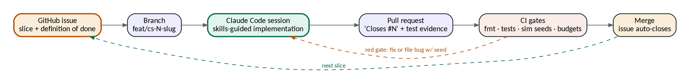

<!--
  Execution Playbook v1.0
  Converted from Execution_Playbook_v1.0.docx - do not edit by hand.
  Source of truth: Execution_Playbook_v1.0.docx
  Regenerate: scripts/convert-docs.sh
-->

**EXECUTION PLAYBOOK**

Issue-Driven Delivery with Claude Code

_credsync (Rust) · dreamlab-os (TypeScript) — every slice starts as a GitHub issue and ends as a merged PR that closes it_

Version 1.0 · 24 August 2026

Companion to: Dream Lab OS Platform Plan v1.1 · credSync Design Document v2.1

## Contents
1\. Operating model — every slice is an issue 3

2\. Repositories, branches & conventions 4

3\. Anatomy of an issue 5

4\. Claude Code configuration — CLAUDE.md & skills 6

5\. CI gates — what merging requires 8

6\. Session protocol — how a slice gets built 9

7\. Initial backlog — credsync (Rust) 10

8\. Initial backlog — dreamlab-os (TypeScript) 12

9\. Bootstrap — issue zero for each repo 14

## 1. Operating model — every slice is an issue
One rule governs all delivery: no code without an issue, no issue without a definition of done, no done without a merged PR that closes it. Claude Code is the builder; GitHub issues are the unit of work, the audit trail, and the shared memory between sessions. A slice is the smallest change that leaves the repository shippable — one protocol type set, one endpoint, one screen, one migration — sized so a single Claude Code session can take it from open to closed.

_Figure 1 — The delivery loop: every slice travels this circuit_

-   **The loop:** pick the top open issue in the current milestone → create branch named for it → Claude Code session implements it with the repo's skills → tests prove the definition of done → PR opens with 'Closes #N' → CI gates pass → merge → the issue closes itself → next issue.
-   **Milestones mirror the plans:** the credsync repo carries milestones M0–M7 (credSync Design v2.1 §10); dreamlab-os carries P0–P7 (Platform Plan v1.1 §15). An issue always belongs to exactly one milestone; milestone completion is the plan's progress bar, visible to Emanamfon and anyone else without asking.
-   **Issues are written before sessions, not during.** Planning sessions (human + Claude in chat, or a dedicated Claude Code planning session) produce batches of issues; build sessions consume them one at a time. Mixing planning and building in one session is the primary failure mode this playbook exists to prevent.
-   **Scope changes are new issues.** Discovering work mid-slice means opening an issue for it and staying on the current one — never expanding a slice in flight.

## 2. Repositories, branches & conventions
| **Item** | **credsync** | **dreamlab-os** |
| --- | --- | --- |
| Language / stack | Rust (Cargo workspace) + npm bindings | TypeScript Turborepo: NestJS api, Vite web, Expo mobile, Astro site, packages |
| Milestones | M0–M7 | P0–P7 |
| Issue prefix in branches | cs | dl |
| Branch naming | feat/cs-<issue#>-<slug> · fix/cs-<issue#>-<slug> | feat/dl-<issue#>-<slug> · fix/dl-<issue#>-<slug> |
| Commits | Conventional Commits (feat:, fix:, test:, docs:, chore:); body references the issue | Same |
| PR rule | Title = issue title; description starts with 'Closes #N'; includes test evidence (command + output summary) | Same |
| Docs in repo | /docs/design-v2.1.md (the credSync design doc, markdown), /docs/spec.md (protocol) | /docs/platform-plan-v1.1.md, /docs/academic-spec.md (the curriculum document, markdown) |
| Labels | area:protocol, area:core, area:server, area:sim, area:ffi, kind:bug, kind:slice, kind:hardening | area:api, area:web, area:mobile, area:site, area:db, area:infra, kind:bug, kind:slice |

**The design documents live inside the repos as markdown.** Claude Code cannot read a PDF on your desk; it can read /docs on every session. Converting the three planning documents to markdown and committing them is part of issue zero (§9) for each repo.

## 3. Anatomy of an issue
Every issue uses one template. The definition of done is executable — a command that passes or a behavior a test proves — never 'works correctly'.

\## Context

Which milestone + which section of which design doc this implements.

One paragraph. Link: /docs/spec.md#pull or /docs/platform-plan-v1.1.md#8

\## Slice

What exactly changes. What is explicitly OUT of scope for this issue.

\## Definition of done

\- \[ \] <executable check 1, e.g. \`cargo test -p credsync-protocol\` green>

\- \[ \] <behavioral proof, e.g. sim seed batch 1000 green with new invariant>

\- \[ \] <docs/fixtures updated if the wire format moved>

\## Skills to use

e.g. rust-sans-io, credsync-protocol (or: drizzle-schema, nestjs-module)

-   Labels: exactly one area:\*, exactly one kind:\*, plus the milestone. Priority is expressed by order in the milestone, not by a label — the top open issue is always the next one.
-   Sizing test: if the definition of done has more than five checkboxes, split the issue before starting it.
-   Bugs found by the simulator get the seed in the issue title: 'sim: divergence at seed 0x4f21…' — the seed is the reproduction, the whole reproduction.

## 4. Claude Code configuration — CLAUDE.md & skills
### 4.1 CLAUDE.md per repository
Each repo's CLAUDE.md is the standing brief every session reads first. It contains, in order: the one-rule operating model (§1), the repo map, the non-negotiables, the commands that must pass before any PR, and pointers into /docs. Non-negotiables per repo:

| **credsync CLAUDE.md non-negotiables** | **dreamlab-os CLAUDE.md non-negotiables** |
| --- | --- |
| The core is sans-IO: no I/O, no clocks, no entropy inside credsync-core — Clock/Entropy/Storage/Transport traits only. #!\[forbid(unsafe\_code)\] in core and protocol. | Every query goes through the tenant-scoped db wrapper; a raw unscoped query is a review-blocking defect. |
| spec.md is law: any wire change updates spec.md, fixtures, and both codec sides in the same PR — never in separate PRs. | Contracts first: endpoints are defined in packages/contracts (Zod) before implementation; api, web, and mobile consume the same contract. |
| Every behavior claim becomes a sim invariant or a property test in the same PR that introduces it. | Screen-shaped read models: one endpoint per screen with its byte budget recorded in the contract; harmattan budget checks run in CI. |
| Never weaken a fault distribution or skip a seed batch to make CI pass — fix the code or file the bug with its seed. | Client-originated writes are credSync commands, never direct row writes; the starred command list in the platform plan §9 is the entire offline write surface. |

### 4.2 Skills — encoded expertise per language and domain
Skills are the playbook's answer to 'relevant skills in the relevant languages': each is a markdown skill in .claude/skills/<name>/SKILL.md that Claude Code loads when its trigger matches, encoding the project's hard-won rules so no session rediscovers them. Issue templates name the skills a slice needs.

| **Skill** | **Repo** | **What it encodes** |
| --- | --- | --- |
| rust-sans-io | credsync | The event-in/effects-out state-machine pattern; the four traits; how to add a state transition with its test; the ban list (no tokio in core, no Instant::now, no thread::sleep) |
| credsync-protocol | credsync | Wire-change procedure: spec.md → types → codec → fixtures → property tests, one PR; checksum and digest rules; versioning/N-1 rules |
| credsync-sim | credsync | How to add a fault, an invariant, or a scenario; seed replay workflow; coverage-statistics reading; the planted-bug drill |
| rust-ffi-bindings | credsync | UniFFI annotation patterns; xcframework/AAR build commands; binding-size budget; the RN fallback path |
| drizzle-schema | dreamlab-os | Migration discipline; institution\_id + RLS policy on every tenant table; outbox + sync\_changes write pattern in one transaction; seed-data structure for the curriculum |
| nestjs-module | dreamlab-os | Module boundary rules (lint-enforced imports); read-model endpoint pattern with byte budget; command-handler pattern for credSync forwarding; outbox event emission |
| expo-offline | dreamlab-os | Local-first screen pattern (read local, write outbox); credSync client API usage; chunked upload with persisted progress; PIN-gated storage |
| contracts-zod | dreamlab-os | Contract-first endpoint definition; how api/web/mobile consume one schema; breaking-change procedure |
| ng-network-budget | dreamlab-os | The NG-3G-p75 budgets table from the platform plan §11; how to run and read the harmattan CI check; what to do when a budget fails |
| gh-issue-flow | both | The §1 loop verbatim: branch naming, Closes #N, test-evidence format in PRs, when to open new issues vs expand scope (never) |

Skills are created in issue zero of each repo (§9) with their SKILL.md content drafted from the design documents, and updated by PR like any code — a lesson learned in a session becomes a skill edit in the same PR.

## 5. CI gates — what merging requires
| **Gate** | **credsync** | **dreamlab-os** |
| --- | --- | --- |
| Format & lint | cargo fmt --check · cargo clippy -D warnings | prettier --check · eslint · tsc --noEmit across the workspace |
| Tests | cargo test (unit + property) all crates | vitest/jest per package; contract round-trip tests |
| Memory & UB | Miri on credsync-core and credsync-protocol | — |
| Simulation | Seed batch (1,000 seeds PR, 10,000 nightly); failure prints the seed | Conformance scenarios against the credSync reference server (once integrated, P2+) |
| Fuzz smoke | cargo-fuzz 60s per wire decoder on PR; long runs nightly | — |
| Performance budgets | core .so size ≤ 3 MB per ABI, tracked per commit | harmattan time budgets on NG-3G-p75 for web bundles; read-model byte budgets asserted in contract tests |
| Bindings build | aarch64 iOS + Android artifacts build on every PR touching core/ffi | Expo prebuild + web build succeed |
| Merge rule | All gates green + PR closes exactly one issue | Same |

**The gates are the reviewer.** Solo-builder reality: there is no second engineer to catch regressions, so the gates carry that role. Weakening a gate to merge is the one forbidden move in this playbook; the correct response to a red gate is a fix or a bug issue with its seed.

## 6. Session protocol — how a slice gets built
-   **Open:** start Claude Code in the repo. First message: 'Work issue #N.' The gh-issue-flow skill has Claude Code read the issue, restate the slice and definition of done in its own words, list the skills it will use, and create the branch — before writing code. A restatement that doesn't match the issue means the issue was unclear: fix the issue first.
-   **Build:** implement inside the named skills' rules. Tests are written with the change, not after — for credsync, the invariant or property test lands in the same commit as the behavior.
-   **Prove:** run the definition-of-done commands verbatim; paste the command + result summary into the PR description under 'Test evidence'.
-   **Close:** PR titled as the issue, body opening 'Closes #N'. After CI is green and the merge lands, the issue auto-closes. Session ends. One issue per session as the default; a second only if the first closed.
-   **Learn:** anything the session discovered that future sessions need (a build quirk, a pattern, a trap) is committed as a skill edit or CLAUDE.md line in the same PR — the repo gets smarter every slice.

**Verbatim session-start prompt:** "Work issue #<N>. Follow gh-issue-flow: restate the slice and definition of done, name the skills you'll use, create the branch, then implement. Do not expand scope; anything extra becomes a new issue. Finish by opening the PR with 'Closes #<N>' and test evidence."

## 7. Initial backlog — credsync (Rust)
Twenty-four slices covering M0–M7, in strict order. Each becomes a GitHub issue verbatim; the milestone column is the GitHub milestone; skills column per §4.2 is filled in the issue template (protocol slices: rust-sans-io + credsync-protocol; sim slices: credsync-sim; ffi slices: rust-ffi-bindings).

| **#** | **MS** | **Slice** | **Definition of done (summary)** |
| --- | --- | --- | --- |
| CS-1 | M0 | Bootstrap workspace: Cargo workspace, crates scaffolded, CI skeleton (fmt/clippy/test), CLAUDE.md + skills committed | CI green on empty crates; skills load in a session |
| CS-2 | M0 | Write spec.md v1 (≤4 pages) from Design v2.1 §5–§6 | Spec reviewed & committed; every §5/§6 rule appears exactly once |
| CS-3 | M0 | Protocol types + canonical JSON codec | proptest round-trip green for all wire types |
| CS-4 | M0 | Batch checksums (xxh3) + order-independent scope digest | Digest property tests: order-independence, tombstone handling |
| CS-5 | M0 | Golden fixtures + publish 0.0.1 name placeholders (crates.io, npm) | Fixtures decode on a clean checkout; names secured |
| CS-6 | M1 | Core skeleton: the four traits, event/effect enums, engine struct | Compiles with #!\[forbid(unsafe\_code)\]; zero I/O deps in cargo tree |
| CS-7 | M1 | Pull apply path: cursor walk, ordered apply, digest maintenance | Unit tests: in-order apply, gap rejection, tombstones |
| CS-8 | M1 | Outbox: enqueue, push batching, per-command results, dead-letter states | Property test: no acknowledged command ever lost across arbitrary result sequences |
| CS-9 | M1 | Conflict application per entity class (server-auth, LWW-per-field, append-only) | Class-conformance tests incl. recovered-draft on LWW loss |
| CS-10 | M2 | Simulator v0: fake traits, seeded scheduler, packet fault menu | 1,000-seed batch runs deterministically; same seed = same trace |
| CS-11 | M2 | Invariants: convergence, durability, idempotency, cursor monotonicity, no-loss | All invariants checked continuously in seed runs |
| CS-12 | M2 | Planted-bug drill: introduce 3 seeded bugs on a branch; harness must catch all | Each caught + replayed from its seed; drill documented in credsync-sim skill |
| CS-13 | M3 | Postgres schema + credsync-server: sync\_changes pagination | Integration test vs real Postgres; batch byte budgets enforced |
| CS-14 | M3 | Command dedupe + result store + payload-checksum rejection | Replay tests: dedupe hit, mutated-replay rejected |
| CS-15 | M3 | Host forwarding: command POST to registered endpoint, outcome recording | Reference in-process host in tests; applied/rejected/superseded paths covered |
| CS-16 | M3 | credsyncd binary (axum): wiring, scope-token validation, backpressure | Server logic runs inside the simulator with the core; e2e sim scenario green |
| CS-17 | M4 | Schema-version migrations client-side + outbox forward-migration | Sim scenario: v-old client vs v-new server through N-1 window |
| CS-18 | M4 | Forced-upgrade envelope + divergence self-heal (tainted scope re-bootstrap) | Sim scenarios green; telemetry events emitted with digest pairs |
| CS-19 | M5 | credsync-ffi: UniFFI surface (feed event / drain effects) + rusqlite storage | Kotlin + Swift bindings build; storage adapter passes conformance |
| CS-20 | M5 | @credsync/react-native package + Expo example app | Airplane-mode demo on device: offline write, kill, reconnect, converge, digests match |
| CS-21 | M6 | cargo-fuzz targets on all wire decoders | 60s smoke in CI; overnight run clean |
| CS-22 | M6 | Coverage hunting: fault-distribution tuning + explored-state report | Report reviewed; distributions adjusted; drill repeated with new bug class |
| CS-23 | M6 | Telemetry surface + docs + quickstart | Quickstart executed cold by Emanamfon; friction items become issues |
| CS-24 | M7 | v0.1.0 release + Dream Lab integration handshake (three reference entities) | Dream Lab student flow passes conformance end-to-end; tag pushed |

## 8. Initial backlog — dreamlab-os (TypeScript)
Twenty-five slices covering P0 through P3. P4–P7 (residency polish, admissions, command center, billing/hardening) get their issue batches at the P3 boundary from Platform Plan v1.1 §15 — writing them now would only rot; the pattern below is the template.

| **#** | **MS** | **Slice** | **Definition of done (summary)** |
| --- | --- | --- | --- |
| DL-1 | P0 | Bootstrap Turborepo: api/web/mobile/site apps, db/contracts/tokens packages, CI skeleton, CLAUDE.md + skills | CI green; skills load; blueprint-tokens consumed by web and mobile hello-screens |
| DL-2 | P0 | Drizzle schema: tenancy & identity group (institutions, programs, cohorts, users, institution\_members) + RLS policies | Migration applies; cross-tenant leak test fails loudly |
| DL-3 | P0 | Auth: register/login/OTP, JWT + refresh in Redis, RBAC guards from tenant-core | Contract tests for all auth flows; role guard matrix tested |
| DL-4 | P0 | Subdomain tenant resolution middleware + tenant-scoped db wrapper | Unscoped query attempt fails a lint/test; dreamlab.<domain> resolves in dev |
| DL-5 | P0 | Curriculum seed from the academic spec: 13 courses w/ credits, 15-week calendar, residency stage defs, graduation requirements | Seed idempotent; totals assert 100 credits and 25/20/10/45 weights |
| DL-6 | P0 | R2 presigned upload/download + CI/CD deploy to Hetzner (Dokploy) + first restore drill | Staging deploy on merge to main; documented restore executed |
| DL-7 | P1 | Learning schema group + outbox + sync\_changes write pattern | Migration + transactional outbox test: state change and log row atomic |
| DL-8 | P1 | Courses & offerings module: CRUD, faculty assignment, read models | Contract + byte-budget tests; offering list ≤ budget |
| DL-9 | P1 | Lessons: text-first content model, image variants via media-pipeline job | Upload → variants generated → lesson renders in web |
| DL-10 | P1 | Assignments + versioned submissions + chunked resumable upload | Kill-and-resume upload test; version history correct |
| DL-11 | P1 | Grading: rubric model, grade submission flow, grading queue read model | Grade → outbox events (portfolio item, competency event) emitted |
| DL-12 | P1 | Elective selection: one-choice rule, deadline, capacity | Second selection rejected; capacity boundary tested |
| DL-13 | P1 | Class sessions + weekly calendar with named major outputs | 15-week calendar renders; weekly-output tracker read model in budget |
| DL-14 | P1 | meet-kit + LiveKit: rooms owned by sessions, role tokens, join web embed | Faculty hosts a session in staging; student token cannot record |
| DL-15 | P1 | Attendance from meeting webhooks + faculty override | Webhook fixture replay produces attendance with durations |
| DL-16 | P2 | Mobile shell: Expo app, auth, PIN gate, blueprint-tokens theme | Runs on device; locked store behind PIN |
| DL-17 | P2 | credSync client integration: scopes wired for the starred command set | Airplane-mode submission converges against staging |
| DL-18 | P2 | Mobile classroom + lesson reader + pack download states | Lesson readable offline after pack download; eviction states render |
| DL-19 | P2 | Mobile submit flow with persisted chunk progress | Upload survives app kill mid-chunk on device |
| DL-20 | P2 | Mobile schedule + audio-first class join + push/WhatsApp fallback via notify-hub | Join at simulated 100 kbps; deadline notification arrives with app killed |
| DL-21 | P3 | Programme Score engine: grades × credit weights incl. residency component split | Property test: totals always ≤100; seeded cohort matches hand-computed scores |
| DL-22 | P3 | Dream Score engine: competency events, weekly snapshot job, radar/growth read models | Snapshot recomputation is idempotent; explainability drill-down works |
| DL-23 | P3 | Portfolio: eight sections auto-assembly + print-PDF export via media-pipeline | Approved artifact appears in portfolio; export renders all sections |
| DL-24 | P3 | Residency: seven-stage workspace, per-stage outputs & credit grading, stage board read models | Stage grade flows into Programme Score; offline stage editing syncs |
| DL-25 | P3 | Graduation engine: ten-requirement checklist + 12-month action plan entity | Checklist flips eligible only when all ten pass; action plan required |

## 9. Bootstrap — issue zero for each repo
Each repository begins with a single meta-issue that installs the operating system this playbook describes. It is the only issue not preceded by another issue.

Issue #0 — Bootstrap the delivery system (label: kind:slice)

\## Definition of done

\- \[ \] CLAUDE.md committed with the §4.1 non-negotiables

\- \[ \] .claude/skills/ created with this repo's skills from §4.2,

drafted from /docs

\- \[ \] /docs contains the design documents converted to markdown

\- \[ \] Issue + PR templates committed (.github/)

\- \[ \] Labels + milestones created (gh label create / gh api)

\- \[ \] The full §7 (or §8) backlog seeded as issues via gh issue create,

scripted so titles, bodies, labels, milestones match this playbook

\- \[ \] CI skeleton green on main

-   The backlog-seeding script is generated by Claude Code inside issue #0 from the tables in this playbook (committed at /docs/execution-playbook.md), so the issues on GitHub are always traceable to this document's version.
-   Order of repos: credsync #0 first (platform P1 = credsync M0–M5), dreamlab-os #0 in parallel week 1 since its P0 does not depend on credSync.
-   This playbook is versioned like the other documents: changes to the loop, the gates, or the templates are PRs against /docs/execution-playbook.md in both repos, and a new version of this document.

**The three documents together:** the Platform Plan (v1.1) says what to build and why; the credSync Design (v2.1) says how the hardest component works; this playbook says how the work actually happens, one issue at a time, with the repo teaching every session its own rules.
