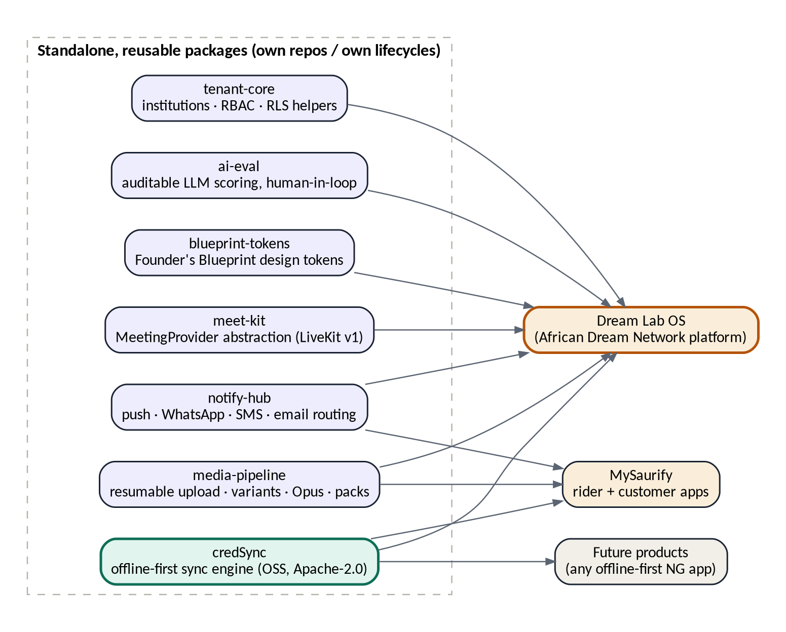
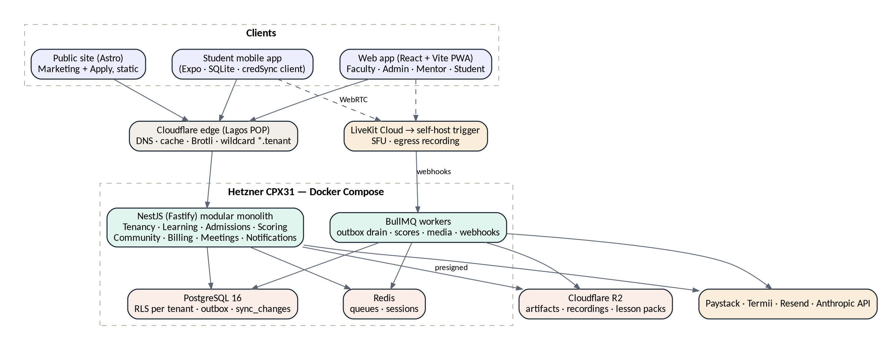
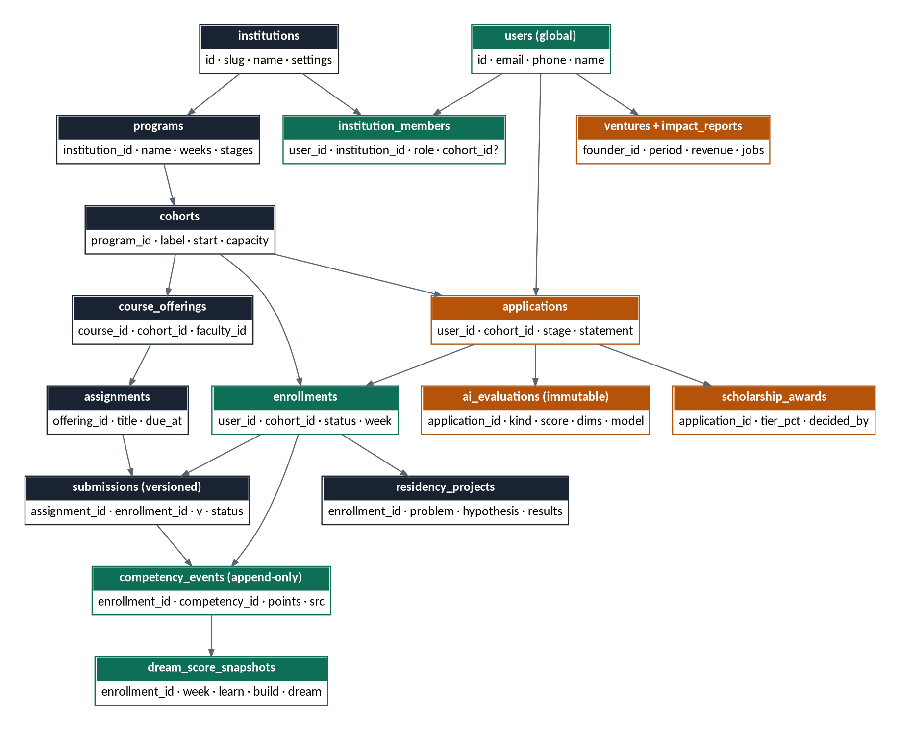
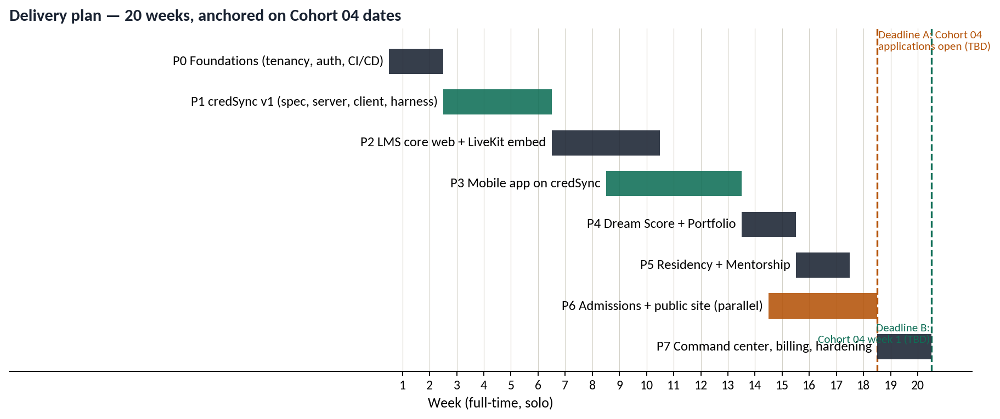

<!--
  Dream Lab OS Platform Plan v1.1
  Converted from DreamLabOS_Plan_v1.1.docx - do not edit by hand.
  Source of truth: DreamLabOS_Plan_v1.1.docx
  Regenerate: scripts/convert-docs.sh
-->

**DREAM LAB OS**

Platform Scope, Architecture & Execution Plan

_The African Dream Network — an operating system for builder institutions_

Version 1.1 · 24 August 2026

Prepared for Ukeme · Working draft for build kickoff

## Contents
1\. Document control & purpose 3

2\. Executive summary 4

3\. Scope definition 5

4\. Engineering principles 7

5\. Reusable component inventory 8

6\. System architecture 10

7\. credSync — the sync engine (Build One) 11

8\. Data model 15

9\. Application modules & API surface 17

10\. Meetings — meet-kit + LiveKit 18

11\. Low-connectivity engineering commitments 19

12\. Infrastructure & operations 20

13\. Security, privacy & NDPA compliance 21

14\. RBAC matrix 22

15\. Delivery plan 23

16\. Risk register 24

17\. Screen inventory — brief for Claude Design 25

18\. Open items 27

## 1. Document control & purpose
This document is the single source of truth for the scope, architecture, and delivery plan of Dream Lab OS — the multi-tenant platform of the African Dream Network, whose first institution is The African Dream Lab. It consolidates every decision made during planning and is structured so that each build phase can be executed directly from it.

**How this document is used:** Section 7 (credSync) doubles as the build brief for the first Claude Code project — it is written to be handed to Claude Code as the opening context of that repository. Section 17 (screen inventory) is the design brief for Claude Design. Sections 8–9 drive the Drizzle schema and API implementation.

| **Item** | **Value** |
| --- | --- |
| Version | 1.1 — integrates the authoritative academic specification ('The African Dream Lab' curriculum document): 100-credit-hour engine, fixed 15-week calendar, 7-stage residency, graduation requirements |
| Academic source of truth | 'The African Dream Lab' curriculum document (received 24 Aug 2026) governs phases, courses, credits, weekly outputs, residency stages, assessment weights, portfolio sections, and graduation requirements. Where the earlier prototype and this document disagree, the curriculum document wins |
| Decisions locked | Multi-tenant from day one · web + mobile together · LMS-first, Cohort 04 native · full offline-first · custom sync engine (credSync, Rust, OSS) · dual content delivery · in-app meetings (LiveKit) · builder full-time · issue-driven delivery via Claude Code (see Execution Playbook) |
| Open inputs | Cohort 04 application-open date (Deadline A) · Cohort 04 start date (Deadline B) · GitHub org availability for credsync |
| Companion documents | credSync Design Document v2.1 (Rust core) · Execution Playbook v1.0 (issue-driven Claude Code delivery) · Claude Design UI brief (§17) |

## 2. Executive summary
Dream Lab OS is an institution operating system for cohort-based builder academies: admissions with auditable AI-assisted scoring, a digital classroom whose every artifact feeds a competency engine (Dream Score™), a structured residency and mentorship layer, in-app live classes, and longitudinal alumni impact tracking. It is multi-tenant from day one: The African Dream Lab is tenant #1 of the African Dream Network.

The defining engineering constraint is the user: a Nigerian student on a low-end Android phone, a congested 3G cell, a data budget, and unreliable power. Every architectural decision in this document flows from that constraint — full offline-first mobile, one-round-trip screens, audio-first content, resumable uploads, WhatsApp/SMS fallback for critical communications, and CI-enforced performance budgets on measured Nigerian network profiles.

The build strategy is standalone-first: any capability with a plausible second consumer is built as an independent, versioned package with its own repository and lifecycle. The flagship is credSync — an open-source offline-first sync engine (Apache-2.0) built before the application, with Dream Lab OS as its reference consumer and the MySaurify rider app as its planned second consumer. Six further reusable packages (meet-kit, notify-hub, media-pipeline, tenant-core, ai-eval, blueprint-tokens) follow the same rule.

Delivery is 20 weeks full-time, anchored on two dates: Deadline A (Cohort 04 applications open — admissions live) and Deadline B (Cohort 04 week 1 — LMS, mobile, sync, and meetings live). Cohort 03 is not migrated mid-cohort; its records are imported at graduation to seed alumni tracking. Total run cost at launch: approximately $25–30/month infrastructure plus $50/month LiveKit Cloud per active-cohort scale, with a defined trigger for self-hosting the media server.

## 3. Scope definition
### 3.1 The product spine
One data spine connects everything; every subsystem is a stage on it:

Applicant → Student → Courses → Competencies → Artifacts → Dream Portfolio → Dream Score → Mentorship → Residency → Demonstration → Graduation → Alumni → Impact

### 3.2 In scope — version 1
-   **Admissions engine.** Ten-stage pipeline (Eligibility → Application → Dream Application → Evidence of Action → Builder Assessment → Video → Interview → Scholarship Review → Committee → Decision). AI-assisted DBPI™/DSI™ composite scoring recorded as immutable evaluations; every stage transition audited; final decisions always human.
-   **Scholarship management.** Tiered awards (100/75/50/25/0%), multi-reviewer scoring with average and variance, configurable weighting, committee decision records.
-   **Digital classroom (LMS).** The 100-credit-hour, four-phase curriculum: Life Architecture (5 courses × 5 credits), Builder's Architecture (5 courses × 4 credits), one elective of exactly one choice (10 credits, from Content Creation, Artificial Intelligence, or Digital Marketing), and the Dream Residency (45 credits). Courses → lessons → assignments → versioned artifact submissions → rubric grading. Every course produces its named Practical Output artifact (Knowledge → Skill → Application → Artifact → Evidence). Class scheduling per the fixed weekly rhythm (Tue/Thu virtual 9:00–10:30 PM, Sat physical 8:30–10:30 AM), measured attendance.
-   **Programme Score engine.** The academic score: each course contributes to the final programme score exactly its credit weight (Phase 1 = 25%, Phase 2 = 20%, Elective = 10%, Residency = 45%, with the residency split across its seven components: 5/5/7/10/6/5/7). Computed, auditable, and the basis of the 100-credit graduation requirement.
-   **Dream Score™ engine.** The competency score, distinct from the Programme Score: ten weighted dimensions, program-configurable per tenant; append-only competency events fed by grading, mentorship, and participation; weekly Learning/Building/Dream snapshots; radar and growth views. Explainable and recomputable.
-   **Residency & mentorship.** The seven-stage residency workspace — Dream Definition, Research & Validation, Solution Design, Build, Testing & Iteration, Impact & Sustainability, Final Demonstration — each stage with its named output document, per-stage credit grading, and faculty review. Mentor assignments and meeting logs, Dream Circles, peer review.
-   **Graduation engine.** A live checklist per student of the ten graduation requirements (100 credits, Life Architecture Blueprint, Builder's outputs, approved elective, residency completion, standards, complete portfolio, final assessment, final demonstration, post-Lab 12-month action plan) — visible to the student, faculty, and admin; graduation is a state transition gated on all ten.
-   **In-app live classes.** LiveKit rooms owned by class sessions and mentor meetings; webhook-derived attendance; recordings auto-transcoded audio-first and published into lesson content and packs.
-   **Command center & impact.** Admissions funnel, cohort health, at-risk flags, institution metrics; alumni ventures and periodic impact reports (revenue, jobs, funding, communities). Alumni feed the mentor pipeline — graduates become mentors, per the self-sustaining community mission.
-   **Dream Portfolio.** Eight fixed sections per the specification — My Dream, Life Architecture, Course Artifacts, Competencies, Dream Residency, Final Demonstration, Dream Score, 12-Month Action Plan — auto-assembled from approved artifacts, publishable on the portal, and exportable as a print-quality PDF (the spec requires both shared and printed).
-   **Public site & apply.** Static, edge-cached marketing front door per tenant with the application flow.
-   **Payments.** Paystack tuition invoicing for partial-scholarship students; subaccounts route settlement directly to institutions.

### 3.3 Explicitly out of scope — version 1
-   Per-tenant customization of the pedagogy model or admissions pipeline structure (branding, terminology, weights, program length, and course content are configurable; the spine is not).
-   Building video infrastructure (SFU, TURN, recording) — integrated via LiveKit behind the meet-kit abstraction.
-   CRDTs, peer-to-peer sync, or multi-device merge beyond last-write-wins — see credSync non-goals (§7.2).
-   Custom-branded meeting UI (prebuilt LiveKit components in v1; custom UI is a P7 polish item).
-   USSD channels, multi-language UI, and a public developer API — deferred until demanded.
-   Marketplace or fund-holding of any kind: the platform never holds institution money.

### 3.4 Roles
Seven roles — Public, Applicant, Student, Faculty, Mentor, Admin, Alumni — modeled as relationships (institution\_members rows scoped to institution and optionally cohort), never as user types. One global identity can hold many roles over time: the demonstration journey (applicant → scholarship student → alumna founder) must work without duplicating the person.

### 3.5 The academic model (authoritative, from the curriculum specification)
The following is fixed curriculum data, seeded at tenant creation for The African Dream Lab and configurable per program for future tenants. The 15-week calendar maps each week to a phase, a course focus, and a named major student output — the LMS tracks weekly outputs as first-class expectations, not just assignment due dates.

| **Phase** | **Weeks** | **Credits** | **Courses / structure** |
| --- | --- | --- | --- |
| Life Architecture | 1–4 | 25 (25%) | Problem Solving, Critical Thinking, Emotional Intelligence, Character Formation & Ethics, Systems Thinking & Formulation — 5 credits each, each with a named Practical Output |
| Builder's Architecture | 5–8 | 20 (20%) | Communication, Negotiation, Financial Intelligence, Personal Branding, Collaboration — 4 credits each |
| Elective | 9–10 | 10 (10%) | Exactly one of: Content Creation, Artificial Intelligence, Digital Marketing. Selection is a student action with a deadline; capacity per offering is admin-configurable |
| Dream Residency | 11–14 | 45 (45%) | Seven graded stages: Dream Definition (5), Research & Validation (5), Solution Design (7), Prototype/Build (10), Testing & Iteration (6), Sustainability & Impact (5), Final Demonstration (7) — each with a named output document |
| Final Assessment | 15 | — | Reviews across all phases; Final Demonstration event; Dream Score™ finalization; graduation decision against the ten-requirement checklist |

**Two scores, never conflated:** the Programme Score is academic and credit-weighted (a course's contribution equals its credit hours as a percentage); the Dream Score™ is the competency radar. The portfolio reports both. The graduation engine gates on credits and requirements; the Dream Score gates nothing — it informs.

## 4. Engineering principles
| **Principle** | **Operating rule** |
| --- | --- |
| Standalone-first | Any capability with a plausible second consumer is built as an independent package: own repo, own version, own tests, consumed as a dependency. Dream Lab OS is an assembly of such packages plus domain logic — not a monolith of one-off code. |
| Offline-first | The student mobile app reads only from its local store; writes queue durably and reconcile via credSync. Online is an optimization, not an assumption. |
| One round trip per screen | Every screen has a single read-model endpoint sized to a byte budget. Chatty APIs are treated as defects. |
| Budgets in CI | Web bundles and key API responses carry time budgets on named Nigerian network profiles (harmattan discipline). A regression fails the build. |
| Cost discipline | Single Hetzner box until a named trigger; managed services only where per-unit cost beats ops time (LiveKit Cloud until ~2–3 concurrent cohorts). |
| Vendor replaceability | Every external service sits behind an internal interface (meet-kit, notify-hub, payments). LiveKit chosen partly because its cloud and self-hosted stacks share one API. |
| Humans decide | AI assists structuring and scoring; admission, scholarship, and grading decisions are recorded human acts referencing immutable AI evaluations. |
| Audit everything consequential | Stage transitions, decisions, meeting events, sync commands: append-only records with actor, time, and basis. |

## 5. Reusable component inventory
The platform is assembled from standalone packages. Each has its own repository (or workspace package with a hard boundary), semantic versioning, and at least one planned consumer beyond Dream Lab OS where marked. This inventory is the contract for what gets extracted versus what stays product code.

_Figure 1 — Standalone packages and their consumers_

| **Package** | **What it is** | **Consumers** | **Repo / license** | **Built in** |
| --- | --- | --- | --- | --- |
| credSync | Offline-first sync engine: change-log pull, command push, cursors, conformance harness | Dream Lab OS, MySaurify rider app, any offline-first product | Own repo · Apache-2.0 (OSS) | P1 |
| meet-kit | MeetingProvider abstraction: rooms, role tokens, webhooks, egress; LiveKit adapter v1 | Dream Lab OS; any product adding calls | Own package · private, OSS candidate | P2 |
| notify-hub | Channel routing with fallback chains: push → WhatsApp → SMS → email (Expo, Termii, Resend); per-tenant metering | Dream Lab OS, MySaurify | Own package · private | P2–P3 |
| media-pipeline | Resumable chunked uploads to R2, image variants, Opus audio transcode, signed lesson-pack manifests | Dream Lab OS, MySaurify | Own package · private | P2–P3 |
| tenant-core | Institutions, membership, RBAC guards, RLS helpers, subdomain resolution | Dream Lab OS; future multi-tenant products | Own package · private | P0 |
| ai-eval | Auditable LLM evaluation: versioned prompts, immutable results, human-decision linkage, bias-audit exports | Dream Lab OS admissions; any human-in-loop scoring | Own package · private | P6 |
| blueprint-tokens | Founder's Blueprint design tokens as plain TS: colors, type, spacing for web CSS and RN styles | Web app, mobile app, public site, Claude Design | Workspace package | P0 |
| contracts | Zod schemas + ts-rest contracts shared by API, web, and mobile | All Dream Lab clients | Workspace package | P0 onward |

**Extraction rule:** packages are extracted from working product code, not designed speculatively. credSync is the exception — it is built first by explicit decision — and it manages that risk by treating Dream Lab's first three synced entities as its reference application (§7.11).

## 6. System architecture

_Figure 2 — Deployment topology_

### 6.1 Modular monolith with an outbox
One NestJS (Fastify) deployable, hard module boundaries enforced by lint rules (Tenancy, Admissions, Learning, Scoring, Community, Meetings, Billing, Notifications). Modules never import each other's internals; they communicate through domain events written to a transactional outbox table in the same Postgres transaction as the state change, drained by BullMQ consumers. 'Submission approved' therefore atomically produces the portfolio item, competency events, a sync\_changes entry, and a notification — with no cross-module coupling and no lost events. Any module can later be extracted to its own service because the boundary and the event stream already exist.

### 6.2 Multi-tenancy
-   Shared database, shared schema, institution\_id on every tenant-owned row. Hierarchy: institutions → programs → cohorts → everything else.
-   Enforcement in depth: an application-level tenant-scoped query wrapper (no unscoped query can be written), plus Postgres row-level security policies on sensitive tables (applications, grades, payments, ai\_evaluations) as backstop.
-   Users are global; membership and roles live in institution\_members scoped to institution + optional cohort.
-   Routing: wildcard subdomain per tenant resolved by middleware into tenant context; custom domains later.
-   Configurable per tenant: branding, terminology, competency dimensions and weights, program length, course content. Fixed: the pedagogy spine and pipeline structure.

### 6.3 Read models
Every client screen is served by one endpoint returning exactly what that screen renders, with a compressed-size budget recorded in the contract (e.g. student dashboard ≤ 25 KB). Round-trip count, not origin latency, is the enemy at 300 ms RTT.

## 7. credSync — the sync engine (Build One)
**This section is the standalone build brief for the first Claude Code project.** It is deliberately self-contained: hand it to Claude Code as opening context for the credsync repository and build from §7.11.

### 7.1 Positioning
credSync is an open-source, offline-first data synchronization engine for client applications on unreliable networks. Server-authoritative, command-based, transport-agnostic over HTTPS, storage-agnostic behind adapters. Written in TypeScript first (server core + client core), protocol specified independently of both so a Rust client core can follow without redesign. License Apache-2.0.

-   **Name status (verified 24 Aug 2026):** npm 'credsync' and 'cred-sync' unregistered; crates.io 'credsync' and 'cred-sync' unregistered; GitHub org availability to be confirmed manually.
-   Reference consumer: Dream Lab OS student app (entities: lessons, submissions, reflections). Second consumer: MySaurify rider app (offline order handling).
-   README leads with: 'Offline-first sync engine for apps on unreliable networks' — pre-empting the credentials-tool misreading of the name.

### 7.2 Goals and non-goals
| **Goals (v1)** | **Non-goals (v1, by design)** |
| --- | --- |
| Server-authoritative sync that never loses an acknowledged client write | CRDTs and automatic semantic merge |
| Works at 2G worst case: small batches, resumable mid-batch, aggressive compression | Peer-to-peer or device-to-device sync |
| Idempotent by construction: any command applied N times ≡ once | Partial-field diff protocols |
| Explainable conflicts: domain-declared policies, losing versions preserved | Multi-device merge beyond per-field LWW |
| Provable correctness: conformance harness ships in the repo | Realtime/websocket transport (push hint only) |
| Protocol versioning with N-1 server compatibility and forced-upgrade path | Syncing admin/faculty surfaces (online web tools) |

**Spec discipline:** the protocol specification must fit in roughly four pages. If it grows past that, scope has crept.

### 7.3 Concepts
| **Concept** | **Definition** |
| --- | --- |
| Scope | The unit of subscription and isolation, e.g. (institution\_id, enrollment\_id) or (institution\_id, cohort\_id). A client syncs only its subscribed scopes; scope membership is authorized server-side at token mint. |
| Entity | A synced table registered with credSync: name, scope mapping, conflict class, schema version. |
| Change log | Append-only sync\_changes table: (seq bigserial, scope, entity, entity\_id, op upsert\|delete, snapshot jsonb, row\_version, schema\_version). Written by domain handlers via the outbox in the same transaction as state changes. Snapshots, not diffs; deletes are tombstones. |
| Cursor | Client's last applied seq per scope. Pull = walk the log forward from the cursor. |
| Command | A client-originated domain mutation: { id: UUIDv7, name, scope, payload, client\_ts, protocol\_version }. The only way client writes reach the server. |
| Dedupe record | Server table keyed by command id storing the outcome; replays return the recorded result without re-applying. |

### 7.4 Protocol (HTTPS + JSON, Brotli/gzip)
#### Pull — GET /sync/pull
request: ?scopes=s1:cursor1,s2:cursor2&limit\_bytes=100000

response: { protocol: 1, batches: \[

{ scope: 's1', changes: \[ { seq, entity, entity\_id, op,

snapshot, row\_version, schema\_version } \],

next\_cursor: 18342, has\_more: true } \] }

-   Batches capped by compressed byte budget (default 100 KB); has\_more drives continuation. A three-week-offline device simply walks forward; a new device bootstraps via an initial snapshot endpoint per scope, then joins the log.
-   Ordering guarantee: changes within a scope are strictly seq-ordered; clients apply in order and persist the cursor transactionally with the applied rows.

#### Push — POST /sync/push
request: { protocol: 1, commands: \[

{ id, name: 'submit\_assignment', scope, payload, client\_ts } \] }

response: { results: \[

{ id, status: 'applied' | 'rejected' | 'superseded',

reason?, server\_seq? } \] }

-   Commands are validated against business rules on arrival (deadline passed, enrollment active, referenced upload present); the server is never a dumb row store for client writes.
-   Push before pull in every sync cycle, so a client immediately observes the server's transformation of its own writes.
-   Rejected commands surface in-app with reason; the outbox entry moves to a dead-letter state visible to the user rather than silently dropping.

#### Sync loop
-   Triggers: app foreground, connectivity regained, silent push 'sync hint', periodic backstop.
-   Backoff: exponential with jitter; requests tolerate 30-second completion; batches resumable mid-cycle.
-   Auth: short-lived scope-bearing JWT minted by the host application; credSync validates scope claims, never authorizes.

### 7.5 Conflict policy (declared per entity class)
| **Entity class** | **Policy** | **Mechanics** |
| --- | --- | --- |
| Institution truth (grades, scores, schedules, statuses) | Server-authoritative | Client never writes these entities; they arrive only via pull. |
| Student-owned drafts (reflections, residency log fields) | LWW per field | Server-assigned row\_version decides; client\_ts is a tiebreaker hint only (device clocks lie). Losing version is returned and stored locally as a recovered draft — no silent loss, ever. |
| Submissions | Append-only versions | No conflict exists: v2 never overwrites v1. |

### 7.6 Versioning & migration
-   protocol\_version on every request; server speaks N and N-1. Below N-1: response 426 with a forced-upgrade envelope the client core understands.
-   Per-entity schema\_version in every snapshot; the client core applies registered up-migrations to local rows and refuses (queues, does not drop) outbox commands authored under a schema the server no longer accepts, surfacing an upgrade prompt.
-   Outbox entries record the schema\_version they were authored under; an upgraded app migrates queued commands forward before pushing.

### 7.7 Package layout
| **Package** | **Contents** |
| --- | --- |
| @credsync/protocol | Types, constants, the four-page spec (markdown, versioned), JSON fixtures |
| @credsync/server | Framework-agnostic core: change-log writer, command dispatcher, dedupe, cursor pagination. Thin @credsync/nestjs adapter |
| @credsync/client | Sync loop state machine, outbox, cursors, migrations — behind a StorageAdapter interface (get/put/transaction/query primitives) |
| @credsync/expo-sqlite | StorageAdapter for Expo SQLite (first shipped adapter) |
| @credsync/web | StorageAdapter for IndexedDB / SQLite-wasm (when the PWA needs offline) |
| @credsync/harness | Deterministic simulation + conformance suite (see 7.8) |

### 7.8 Conformance & simulation harness
The harness is the trust artifact: any adapter or port (including the future Rust core) that passes conformance is correct by construction. Deterministic, seeded, no wall clocks.

-   Network faults: drop every Nth request, duplicate responses, reorder batches, 90-second flaps, mid-batch disconnects.
-   Properties asserted: convergence (client state ≡ server projection after quiescence), idempotency (replayed commands change nothing), cursor monotonicity, no acknowledged-write loss under any scripted fault sequence.
-   Scenario fixtures: three-week-offline device catch-up; wrong-clock device (skewed ±3 days) resolving LWW correctly via row\_version; v1.2 client against v1.5 server through the N-1 window; forced upgrade with queued outbox migration.

### 7.9 Claude Code build plan (repository: credsync)
| **Milestone** | **Deliverable** | **Definition of done** |
| --- | --- | --- |
| M0 — Spec & types | @credsync/protocol: spec.md (≤4 pages), full TS types, JSON fixtures | Spec reviewed; fixtures round-trip through types; npm names reserved by publishing 0.0.1 placeholders |
| M1 — Server core | @credsync/server: change-log writer, dispatcher, dedupe, pull pagination + Postgres schema (sync\_changes, sync\_command\_results) | Unit tests green; example in-memory domain handlers demonstrate apply/reject/supersede |
| M2 — Client core | @credsync/client: sync state machine, outbox, cursors, migration hooks over a mock StorageAdapter | State machine covered; push-then-pull cycle proven against M1 server in-process |
| M3 — Harness | @credsync/harness: fault injection + conformance properties | All §7.8 properties pass under seeded fault runs; CI matrix established |
| M4 — Expo adapter | @credsync/expo-sqlite + example Expo app syncing the three reference entities | Conformance passes on-device; airplane-mode demo: write offline, kill app, reconnect, converge |
| M5 — NestJS adapter + reference server | @credsync/nestjs wired into a minimal reference server with lessons/submissions/reflections handlers | End-to-end demo repo; README + quickstart; tag v0.1.0 |

**First Claude Code session brief:** "Initialize a pnpm + Turborepo monorepo named credsync (Apache-2.0). Create @credsync/protocol containing spec.md and the TypeScript types for: Scope, EntityRegistration, Change, PullRequest/Response, Command, PushRequest/Response, ConflictClass, protocol/schema versioning rules — exactly as defined in §7.3–7.6 of the Dream Lab OS plan. Write spec.md first, types second, fixtures third. Do not begin @credsync/server until spec.md is complete and under four pages."

## 8. Data model

_Figure 3 — Core entity relationships (green: identity & growth spine · gold: admissions & impact · navy: learning)_

### 8.1 Schema groups
| **Group** | **Tables** | **Notes** |
| --- | --- | --- |
| Tenancy & identity | institutions, programs, cohorts, users, institution\_members, profiles | users global; roles are memberships. RLS anchored on institution\_id |
| Admissions | applications, application\_evidence, application\_reviews, ai\_evaluations, interviews, scholarship\_awards, stage\_transitions | ai\_evaluations immutable (model, prompt\_version, dims); stage\_transitions is the audit spine |
| Learning | courses, course\_offerings, lessons, assignments, submissions, grades, elective\_selections, weekly\_outputs, class\_sessions, attendance | courses seeded with curriculum credits; elective\_selections enforce the one-elective rule; weekly\_outputs track the calendar's named major output per week; submissions append-only versioned; attendance derived from meeting\_events with faculty override |
| Scoring | competencies (per program, weighted), competency\_events, dream\_score\_snapshots, programme\_scores | two engines: programme\_scores computed from grades × credit weights (25/20/10/45, residency split 5/5/7/10/6/5/7); Dream Score events append-only, snapshots weekly — both explainable and recomputable |
| Portfolio & residency | portfolio\_items (8 fixed sections), reflections, residency\_projects, residency\_stages, action\_plans, graduation\_checks | residency\_stages: the seven graded stages with named outputs and per-stage credits; action\_plans: the post-Lab 12-month plan (graduation requirement); graduation\_checks: live status of the ten requirements; portfolio exportable as print PDF via media-pipeline |
| Community | mentor\_assignments, mentor\_meetings, dream\_circles, circle\_members, peer\_reviews |  |
| Meetings | meeting\_rooms, meeting\_events (raw webhooks), recordings | rooms owned by class\_sessions / mentor\_meetings; never client-created |
| Impact | ventures, impact\_reports, verifications | self-reported metrics carry verification status (unverified / documented / attested) |
| Ops | invoices, payments, notifications, notification\_deliveries, audit\_logs, outbox, sync\_changes, sync\_command\_results | outbox + sync tables are credSync's server-side surface |

### 8.2 Sync-scoped entities (v1)
-   **Scope** (institution, enrollment): submissions (own), grades (pull-only), programme\_scores (pull-only), reflections, residency\_projects + residency\_stages, action\_plans, dream\_score\_snapshots (pull-only), graduation\_checks (pull-only), portfolio\_items (pull-only), attendance (own, pull-only), notifications.
-   **Scope** (institution, cohort): lessons, assignments, class\_sessions, dream\_circles, recordings metadata + pack manifests.
-   Everything else (admissions, faculty, admin, billing) is online-only web territory by design.

## 9. Application modules & API surface
Each module owns its tables, its read models, its commands (client-originated via credSync where synced), and its emitted events. Summary of the surface per module:

| **Module** | **Key read models (one per screen)** | **Key commands / mutations** | **Emits** |
| --- | --- | --- | --- |
| Tenancy | institution context, member roster | invite member, assign role, create cohort | member.added |
| Learning | student dashboard, classroom, offering detail, elective picker, grading queue, cohort roster, weekly-output tracker | submit\_assignment\*, select\_elective\*, grade submission, schedule session, log\_attendance\* | submission.approved, elective.selected, session.completed |
| Scoring | score card (Programme Score + Dream Score radar/growth), competency detail | (none client-side — computed) | score.snapshotted, programme\_score.updated |
| Community | mentor roster, circle view, residency stage board | save\_reflection\*, update\_residency\_stage\*, save\_action\_plan\*, log meeting, peer\_review\* | stage.completed, graduation.eligible |
| Admissions | pipeline board, application detail, review queue, scholarship review | advance stage, record review, request AI eval, award scholarship | applicant.admitted |
| Meetings | join surface (token mint) | create room (server-only), start recording | participant.joined/left, recording.ready |
| Billing | invoice list, payment status | issue invoice, reconcile webhook | invoice.paid |
| Impact | alumni portfolio, network dashboard | report\_impact\*, verify report | impact.reported |

**\*** \= client-originated credSync commands (offline-capable). Everything else is online web API. The starred set is deliberately small — it is the entire offline write surface of v1.

## 10. Meetings — meet-kit + LiveKit
### 10.1 Provider decision
LiveKit: open-source (Apache-2.0) SFU with a managed cloud running the same server — migration between cloud and self-hosted requires no application changes, which makes the replaceability principle literal. React Native and web SDKs from one integration; Dynacast degrades or pauses non-visible streams, which is what a 30-person class on 3G requires. Cost path: free Build tier for development, ~$50/month Ship tier per active-cohort scale; self-host trigger when cloud spend exceeds the cost of a second Hetzner box (~2–3 concurrent cohorts network-wide).

### 10.2 Integration rules
-   Rooms are owned by domain entities (class\_session, mentor\_meeting) and created server-side only; room names are tenant-namespaced. The API mints short-lived role-mapped join tokens (faculty: host powers; students: audio publish, video on request) for enrolled participants only.
-   Attendance is a webhook consumer, not a form: participant\_joined/left events land raw in meeting\_events; a BullMQ consumer derives attendance with join duration. Faculty can override; the default is measured truth.
-   Recordings: LiveKit egress → R2 → recording.ready webhook → media-pipeline job transcodes the audio-first Opus variant (~7–8 MB per 90-minute class) → registered as lesson content → enters sync scopes and the following week's lesson pack automatically. The recording pipeline is the guaranteed path for students who cannot join live.
-   Low-data posture by default: on cellular, students join audio-only with video opt-in; faculty publish simulcast; screen-share outranks camera. Join flow carries a time budget on the NG-3G profile like every other screen.
-   Policy item for the institution (not engineering): whether watching the recording within 48 hours counts toward attendance. The schema supports either answer.

## 11. Low-connectivity engineering commitments
| **Surface** | **Budget (NG-3G-p75 profile)** | **Mechanism** |
| --- | --- | --- |
| Student mobile app cold start | Usable < 2 s (local reads) | credSync local-first reads; no network on critical path |
| Student dashboard read model | ≤ 25 KB compressed, 1 round trip | Screen-shaped endpoint, Brotli |
| Web app first interactive | ≤ 5 s | Route-level code splitting; CI budget fails regressions (harmattan) |
| Public site first paint | ≤ 2.5 s | Static Astro, edge-cached at Lagos POP |
| Assignment upload (40 MB) | Completes on a link flapping every 90 s | media-pipeline: 5 MB chunks, per-chunk retry, persisted progress |
| Live class join | Audio joinable at ~100 kbps down | Audio-only default, simulcast, TURN over TCP fallback |
| Missed class | Full content within 24 h offline-capable | Opus recording into lesson pack |
| Deadline notification | Reaches student without the app alive | notify-hub fallback chain: push → WhatsApp → SMS |

-   Device floor: Android 9+, 1.5 GB free storage assumption; lesson packs carry an eviction policy (packs older than the course week auto-purge, recordings become stream-only).
-   Local store privacy on shared phones: app-level PIN/biometric gate over the SQLite store; one-student-per-install rule in v1.
-   Data-as-money: every feature review asks what it costs the student in megabytes. Recorded in the design review checklist.

## 12. Infrastructure & operations
| **Concern** | **v1 answer** | **Scale trigger → next step** |
| --- | --- | --- |
| Compute | One Hetzner CPX31 (~€15/mo), Docker Compose via Dokploy: API, workers, Postgres, Redis; staging as second stack on same box | Multiple concurrent cohorts → dedicated DB box, then app/worker split |
| Edge | Cloudflare: wildcard \*.tenant DNS, proxy, cache, Pages for the static site | Custom tenant domains via CF for SaaS |
| Storage | R2, keys prefixed {institution\_id}/…; presigned upload/download | — |
| Meetings | LiveKit Cloud (Build → Ship $50/mo) | Cloud spend > second-box cost → self-host SFU on Hetzner (same API) |
| Backups | Nightly pg\_dump + WAL archiving to R2; monthly restore drill with documented RTO ≈ 1 h | PITR via pgBackRest when cohorts overlap |
| CI/CD | GitHub Actions → GHCR → deploy webhook; harmattan budgets + credSync conformance in the pipeline | — |
| Observability | Sentry (free tier), Uptime Kuma, structured logs; status comms via WhatsApp broadcast on incident | Grafana/Prometheus at multi-box |
| Run cost at launch | ≈ $25–30/mo infra + $50/mo LiveKit per active-cohort scale + per-message notify spend (metered per tenant) | — |

**Backups are a prayer until restored:** the monthly restore drill is a scheduled calendar event, not an aspiration. The first drill happens in P0 before any real data exists.

## 13. Security, privacy & NDPA compliance
-   Authentication: email/phone + password with OTP verification; JWT access + refresh sessions in Redis; app-level PIN gate on the mobile local store.
-   Authorization: RBAC guards from tenant-core (role × capability matrix, §14) plus Postgres RLS on sensitive tables as backstop. credSync scope tokens carry authorized scopes only.
-   NDPA 2023: consent captured at application (explicitly covering AI-assisted evaluation and PII processing by the model API under a data-processing agreement); data-subject export and deletion flows; minors handled per institution policy with guardian consent fields.
-   AI fairness: ai-eval ships a per-cycle bias audit export — AI score vs human score distributions by region and gender. Reviewed by the institution each intake; material divergence triggers prompt/rubric revision. Applicant-facing disclosure that AI assists and humans decide.
-   Impact data integrity: impact\_reports carry verification status; network-level dashboards display verified and unverified figures separately, so funder-facing numbers are never silently self-reported.
-   Audit: stage\_transitions, decisions, meeting\_events, sync commands, and admin actions are append-only with actor and timestamp.

## 14. RBAC matrix
| **Capability area** | **Public** | **Applicant** | **Student** | **Faculty** | **Mentor** | **Admin** | **Alumni** |
| --- | --- | --- | --- | --- | --- | --- | --- |
| View public site / apply | ✓ | ✓ | — | — | — | — | ✓ |
| Own application & status | — | ✓ | — | — | — | read all | — |
| Review / advance applications | — | — | — | assigned | — | ✓ | — |
| Classroom: view lessons, submit | — | — | ✓ | view | view | view | — |
| Grade & rubric | — | — | — | ✓ own offerings | — | override | — |
| Schedule sessions / host meetings | — | — | join | ✓ | ✓ 1:1s | ✓ | — |
| Dream Score & portfolio | — | — | own | cohort | assigned | all | own |
| Residency workspace | — | — | own | review | assigned | all | read own |
| Mentorship logs | — | — | own view | — | ✓ assigned | all | — |
| Command center & funnel | — | — | — | — | — | ✓ | — |
| Scholarship review / award | — | — | — | — | — | ✓ committee | — |
| Billing & invoices | — | — | own | — | — | ✓ | — |
| Impact reporting | — | — | — | — | — | verify | ✓ own |
| Tenant settings & members | — | — | — | — | — | ✓ | — |

_Roles are additive memberships; a user holding Faculty at one institution and Alumni at another resolves per tenant context._

## 15. Delivery plan

_Figure 4 — 20-week full-time plan; final ordering locks when Cohort 04 dates are known_

| **Phase** | **Weeks** | **Exit criteria** |
| --- | --- | --- |
| P0 Foundations | 1–2 | Tenant created, Cohort 03 users importable, auth + RBAC live, CI/CD deploying to Hetzner, first restore drill done, blueprint-tokens + contracts packages seeded, curriculum seed loaded from the academic spec (13 courses with credits, 15-week calendar, residency stage definitions, graduation requirements) |
| P1 credSync v1 | 3–6 | M0–M5 complete (§7.9); v0.1.0 tagged; conformance green in CI; airplane-mode demo recorded |
| P2 LMS core (web) + meetings | 7–10 | Faculty run a full real class week: lessons up, assignment graded, session hosted in-app, attendance derived from webhooks |
| P3 Mobile app | 9–13 | Student submits an assignment offline on a real device over a flaky connection and it reconciles; push + WhatsApp fallback proven |
| P4 Score + Portfolio | 14–15 | Programme Score computes from real grades × credit weights (residency 5/5/7/10/6/5/7 split verified); Dream Score weekly snapshot produces radar + growth; portfolio auto-assembles its eight sections; graduation checklist live; print-PDF export works |
| P5 Residency + Mentorship | 16–17 | Full week-11 experience demonstrable end-to-end |
| P6 Admissions + public site | 15–18 (parallel) | An applicant completes the full pipeline; AI evals recorded immutably; committee decision audited. Must complete before Deadline A |
| P7 Command center, billing, hardening | 19–20 | Funnel + impact dashboards live; Paystack invoicing; NDPA review pass; load + 3G test pass |

-   **Deadline A** (Cohort 04 applications open — date TBD): admissions live. If this date lands before plan week 15, P6 jumps ahead of P4/P5 and the order flips.
-   **Deadline B** (Cohort 04 week 1 — date TBD): LMS, mobile, sync, meetings live. Two-week buffer required between P3 exit and this date.
-   Cohort 03: no mid-cohort migration. Final records imported at graduation to seed alumni tracking.

## 16. Risk register
| **#** | **Risk** | **Impact** | **Mitigation** |
| --- | --- | --- | --- |
| R1 | Sync bugs lose student work silently | Trust-fatal | Command-based writes, ack-before-clear outbox, conformance harness properties (§7.8), dead-letter surfacing |
| R2 | Client schema drift vs server (weeks-offline devices) | Stranded writes | Protocol N-1 window, per-entity schema\_version, outbox forward-migration, forced-upgrade envelope |
| R3 | Device clock skew corrupts LWW | Wrong merges | Server row\_version authoritative; client\_ts tiebreaker only; harness scenario |
| R4 | credSync gold-plating without a consumer | Schedule | Reference entities drive scope; four-page spec ceiling; docs polish deferred to second consumer |
| R5 | 9 PM classes vs congestion + power cuts | Attendance | Audio-only default, TURN/TCP, recording-counts-as-attendance policy option, Saturday physical anchor |
| R6 | Android OEM push killing (Transsion) | Missed deadlines | notify-hub fallback chain; delivery receipts logged per channel |
| R7 | Storage pressure on 32 GB devices | Uninstalls | Pack eviction policy; recordings become stream-only after course week |
| R8 | Single-box failure | Full outage (not classes) | Rehearsed restore, RTO ≈ 1 h, WhatsApp status channel; LiveKit Cloud keeps live classes independent |
| R9 | AI scoring bias against non-standard English | Fairness, reputation | Rubric-anchored prompts, per-cycle bias audit export, Evidence-of-Action weighting, human decisions only |
| R10 | Self-reported impact numbers challenged by funders | Credibility | Verification statuses; dashboards separate verified/unverified |
| R11 | Tenant demands to customize the pedagogy spine | Config creep | Fixed-spine rule in scope (§3.3); config limited to declared surface |
| R12 | Notification spend scales per message | Cost creep | Per-tenant metering in notify-hub; pass-through billing at multi-tenant stage |

## 17. Screen inventory — brief for Claude Design
Design system: Founder's Blueprint (deep architectural navy #0A0F1E, graph-paper grid, gold ink #D8A84E for annotation, jade #3CB795 for growth/measurement; Space Grotesk display, Inter body, JetBrains Mono data). Tokens ship as the blueprint-tokens package; the existing prototype covers desktop web layouts for most web screens — every mobile screen below is net-new design.

### 17.1 Mobile app (student-first) — all net-new
| **Screen** | **Notes** |
| --- | --- |
| Onboarding + PIN gate | Low-literacy-friendly; offline-capable after first login |
| Student dashboard | Dream statement, journey strip, week context, scores summary, next actions; renders 100% from local store |
| Classroom: course list / lesson reader | Text-first reader; pack download state (downloaded / streamable / evicted); weekly major-output banner per the 15-week calendar |
| Elective selection | One-choice picker (Content Creation / AI / Digital Marketing) with deadline and capacity states; locks after selection |
| Assignment detail + submit | Camera + file, chunked upload progress that survives app kill; version history; the course's named Practical Output is the framing |
| Schedule + class join | Audio-first join sheet; data-cost indicator; recording fallback link |
| Live class (LiveKit prebuilt v1) | Custom skin later (P7); raise-hand, mute, leave |
| Residency workspace (7 stages) | Stage board: Dream Definition → Research → Design → Build → Test → Impact → Demonstration; each stage shows its named output, credits, grading state; offline stage editing |
| Graduation checklist | Live status of the ten requirements; credits earned of 100; what remains |
| 12-Month Action Plan | Structured post-Lab plan editor; required for graduation; offline-capable |
| Reflections | Weekly prompt; recovered-draft affordance when LWW loses |
| Portfolio | Read view of the eight fixed sections; share link; print-PDF export request |
| Dream Score | Programme Score (credits earned, weighted) + Dream Score radar and growth line; explainability drill-down (which events moved which dimension) |
| Notifications inbox | Mirrors WhatsApp/SMS-delivered criticals |
| Sync status surface | Outbox state, last sync, dead-letter items with reasons — honesty UI |
| Mentor-lite views | Roster + meeting log (mentor role only) |

### 17.2 Web app
| **Role** | **Screens** |
| --- | --- |
| Student | Parity subset of mobile (dashboard, classroom, portfolio, residency) as PWA |
| Faculty | Grading queue, rubric grading view, residency stage grading (per-stage credits), offering management, session scheduling + host view, cohort progress table, weekly-output tracker, attendance override |
| Mentor | Assigned roster, student detail, meeting log |
| Admin | Command center, admissions pipeline board, application detail + review, scholarship review, cohort/member management, elective capacity management, graduation review board (ten-requirement checklist per student), tenant settings, billing, impact verification |
| Alumni | Impact portfolio, venture + report submission |

### 17.3 Public site (per tenant)
| **Page** | **Notes** |
| --- | --- |
| Home / philosophy / journey | Prototype hero + journey strip carry over; 3G-first budgets |
| Apply flow | Ten-stage aware; evidence upload (chunked); video upload with audio-only fallback prompt |
| Applicant status portal | Stage tracker; decision + scholarship display |

## 18. Open items
-   Cohort 04 dates (Deadlines A and B) — the only inputs that can reorder the plan. Owner: Ukeme/Emanamfon.
-   GitHub org 'credsync' availability — manual check; then publish npm placeholder packages at M0.
-   LiveKit Cloud account + egress pricing confirmation at Ship tier for 90-minute composite recordings.
-   Termii WhatsApp Business API onboarding lead time (can be weeks) — start in P0, not P3.
-   Institution policy decisions: recording-counts-as-attendance window; minor-applicant guardian consent flow; Cohort 03 graduation import field list.
-   Paystack subaccount setup for The African Dream Lab; confirm platform-fee merchant-of-record structure with Paystack.
-   Trademark filings for Dream Score™, DBPI™, DSI™ under the African Dream Network entity.

**Next actions from this document:** (1) confirm Cohort 04 dates → lock final phase order; (2) open the credsync repository with Claude Code using §7.9–7.11; (3) hand §17 with blueprint-tokens to Claude Design for the mobile screen set.
